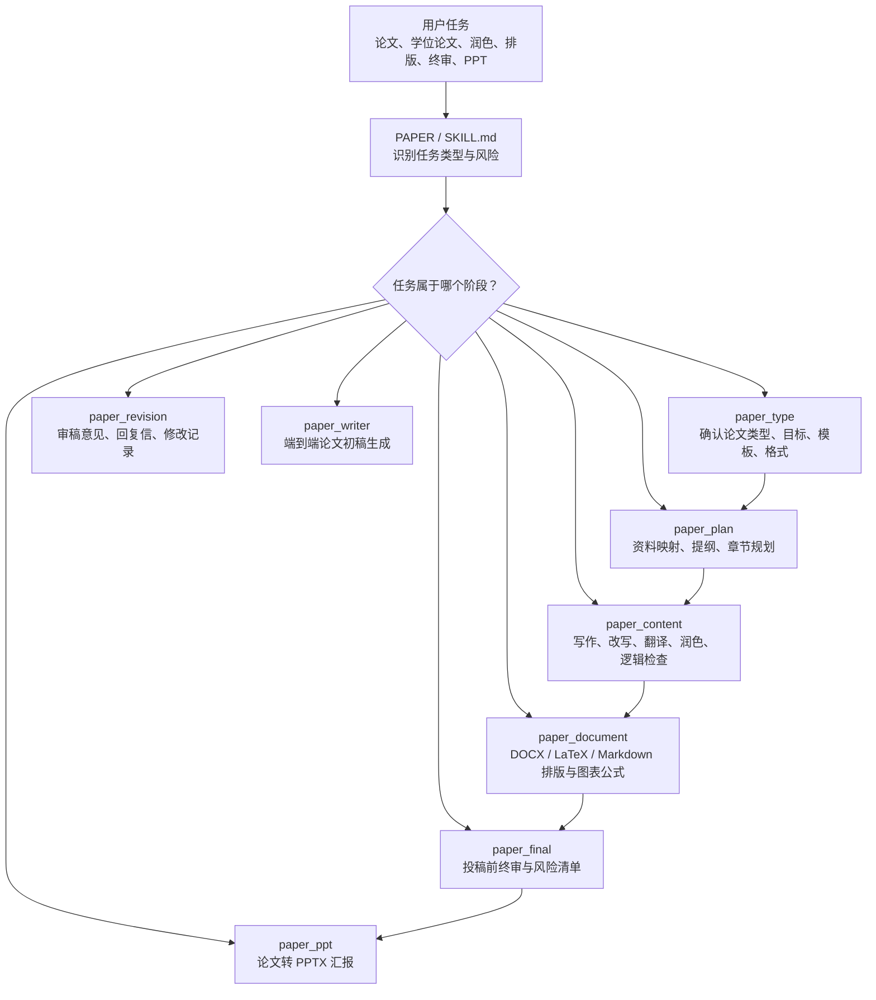
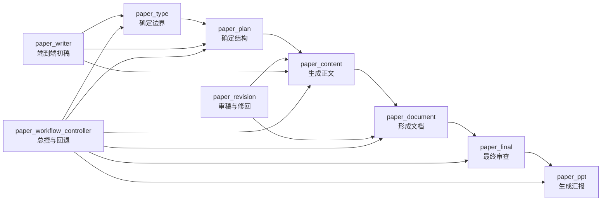
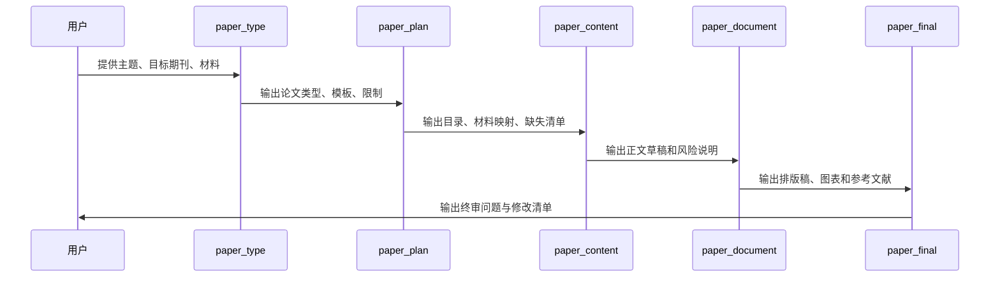
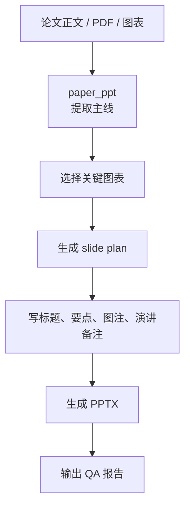

# PAPER 学术论文工作流使用指南

`PAPER` 是一个统一的学术论文、期刊论文、会议论文、学位论文与论文汇报工作流技能。它不是单一写作模板，而是一个由多个阶段模块组成的论文协作系统，用来完成从选型、规划、写作、润色、排版、终审到 PPT 汇报生成的完整链路。

入口文件：

- `SKILL.md`：总入口，负责识别任务、选择模块和执行学术完整性规则。
- `modules/`：各阶段模块的详细规则。
- `references/`：模块交接 schema、论文类型要求、模板合规提取规则。
- `scripts/`：辅助脚本，目前包含 PPTX 依赖检查。
- `agents/openai.yaml`：技能展示和默认调用信息。

## 1. 一张图看懂 PAPER



图文解释：

- 如果你不知道从哪里开始，先让 `PAPER` 进入 `paper_workflow_controller` 或 `paper_type`，确认论文类型、目标期刊/会议/学校、模板和输出格式。
- 如果你已有资料但没有结构，用 `paper_plan` 生成目录、章节功能、材料映射和缺失清单。
- 如果你已有正文，需要写作、翻译、压缩、扩写或 Nature 风格润色，用 `paper_content`。
- 如果你要生成 Word、LaTeX、Markdown、图表、公式或参考文献格式，用 `paper_document`。
- 如果你要投稿、答辩或交导师前检查，用 `paper_final`。
- 如果你要处理审稿意见、回复信、修改说明，用 `paper_revision`。
- 如果你要把论文做成组会、答辩或课程汇报 PPT，用 `paper_ppt`。

## 2. 模块关系图



图文解释：

- `paper_type -> paper_plan -> paper_content -> paper_document -> paper_final` 是最稳妥的完整论文路线。
- `paper_revision` 可以回到写作或排版阶段，因为审稿意见常常要求同时改正文、图表和格式。
- `paper_writer` 适合端到端初稿，但仍要遵守类型确认、证据映射和最终审查。
- `paper_workflow_controller` 是调度器：它负责判断下一步、回退、询问缺失信息或启动快速处理。

## 3. 最常用命令指南

这里的“命令”指你在对话中发给 Codex / Agent 的自然语言指令。推荐统一以“使用 PAPER”开头，这样系统会明确调用该技能。

### 3.1 完整论文从零开始

```text
使用 PAPER。我要写一篇[论文类型]，方向是[学科/主题]，目标是[期刊/会议/学校]。
我提供的材料包括：[材料列表]。
请先确认论文类型、模板要求、输出格式和缺失信息，再规划完整写作流程。
```

适用模块：

- `paper_workflow_controller`
- `paper_type`
- `paper_plan`

输出通常包括：

- 论文类型与目标场景
- 输出格式建议
- 需要确认的信息
- 后续模块路线
- 缺失材料与风险提示

### 3.2 确认论文类型与模板要求

```text
使用 PAPER，帮我确认这篇论文的写作类型、目标期刊格式、篇幅、图表公式和参考文献要求。
目标期刊/会议/学校是：[名称]。
模板或投稿指南如下：[粘贴规则或提供文件]。
```

适用模块：

- `paper_type`

适合场景：

- SCI 论文投稿前确认规则
- 会议论文页数、匿名化、补充材料要求确认
- 硕士论文学校模板规则确认
- 中文期刊 GB/T 7714、摘要、关键词、基金、图表题名规则确认

### 3.3 根据资料规划论文目录

```text
使用 PAPER，根据我提供的论文、实验数据和草稿，规划一篇[论文类型]的目录。
请说明每一章/节使用哪些材料，列出缺失内容、术语表和潜在重复风险。
```

适用模块：

- `paper_plan`

输出通常包括：

- 题目方向建议
- 章节目录
- source-to-outline 材料映射
- 术语一致性表
- 缺失材料清单
- 自我重复或证据不足风险

### 3.4 写作、改写、润色、翻译

```text
使用 PAPER，把下面这段内容改写为[中文/英文/Nature 风格/SCI 风格]。
要求：保留技术含义和数值，不添加新结果，不虚构引用，指出逻辑缺口。
文本如下：
[粘贴文本]
```

适用模块：

- `paper_content`

适合任务：

- 写摘要、引言、方法、结果、讨论、结论
- 中文转英文
- 英文 SCI 润色
- Nature-style paragraph reconstruction
- 扩写或压缩
- 降低过度声明
- 检查 claim 与证据链

### 3.5 快速小任务

```text
使用 PAPER，fast_track=true。请只润色下面这一段，不改变技术含义，并给出残余风险。
[粘贴一小段文本]
```

适用模块：

- `paper_content`
- `paper_document`

适合场景：

- 一句话语法修正
- 一个短段落润色
- 一个标题优化
- 一个参考文献标点修复
- 一个图注微调
- 一个简短翻译

注意：完整摘要重写、整节重写、多参考文献审查、全文排版和学位论文章节工作不属于 fast track。

### 3.6 引用检查与证据支持

```text
使用 PAPER，逐句检查下面段落的引用需求。
请拆分 claim，判断是否需要引用，给出候选文献支持等级，并指出缺失证据。
[粘贴段落和可用文献]
```

适用模块：

- `paper_content`
- `paper_final`

支持等级：

- `strong support`：文献或数据直接支持。
- `partial support`：只支持部分内容。
- `background support`：只适合作为背景引用。
- `contradictory/limiting`：存在相反或限制性证据。
- `metadata-only candidate`：只有题录信息，未验证全文证据。

### 3.7 生成或优化论文图

```text
使用 PAPER，根据以下实验数据生成论文图。
请先给出 figure contract，再生成图件。输出 SVG 和 PNG，并检查坐标轴、单位、图例、统计标注、caption 和正文 claim 是否一致。
[粘贴数据或说明数据文件]
```

适用模块：

- `paper_document`
- `paper_final`

推荐流程：

1. 确认每个 panel 支持的论文 claim。
2. 建立 figure contract。
3. 生成或重绘图件。
4. 检查坐标轴、单位、统计标注和图例。
5. 生成图文一致性报告。

### 3.8 Word / LaTeX / Markdown 排版

```text
使用 PAPER，按照这个[Word/LaTeX/Markdown]模板排版我的论文。
请检查标题层级、图表、公式、参考文献、页眉页脚和模板合规性。
不要改变技术含义。
```

适用模块：

- `paper_document`

注意事项：

- 不擅自修改技术内容。
- 不虚构 DOI、页码、期刊名、卷期号等参考文献信息。
- 不声称 LaTeX 编译成功，除非实际运行编译并成功。
- 工作说明应进入报告文件，不应混入论文正文。

### 3.9 投稿或答辩前终审

```text
使用 PAPER，对这篇[SCI/会议/中文期刊/硕士论文]做提交前终审。
重点检查语言、逻辑、引用、图文一致性、模板合规性和审稿人可能质疑的问题。
```

适用模块：

- `paper_final`

输出通常包括：

- Fatal / Major / Minor / Optional 问题分级
- 技术风险
- 格式风险
- 引用和参考文献风险
- 图表与正文一致性风险
- 必须修改项和建议修改项

### 3.10 审稿意见回复与修回

```text
使用 PAPER，根据以下审稿意见和我的修改稿，生成 point-by-point response letter。
请区分已经修改、需要补充、不能完全满足和需要解释的意见，并生成修改记录。
[粘贴审稿意见和修改说明]
```

适用模块：

- `paper_revision`

适合场景：

- 回复审稿人意见
- 生成 response letter
- 生成 revision history
- 对比修改前后差异
- 准备 resubmission package

### 3.11 论文转 PPTX

```text
使用 PAPER，把这篇论文做成[页数]页[中文/英文/双语] PPTX，用于[组会/答辩/课程汇报/论文分享]。
请提取论文主线，选择关键图表，写 slide title、要点、caption 和 speaker notes，并生成 QA 报告。
```

适用模块：

- `paper_ppt`

建议输出：

- `presentation.pptx`
- `asset_manifest.md`
- `ppt_qa_report.md`
- `assets/figures/`

PPTX 依赖检查命令：

```powershell
python C:\Users\Compus\.agents\skills\PAPER\scripts\check_ppt_dependencies.py
```

## 4. 任务到模块速查表

| 你的目标 | 推荐模块 | 推荐命令开头 |
|---|---|---|
| 不知道怎么开始写论文 | `paper_workflow_controller` | `使用 PAPER，帮我规划完整论文流程...` |
| 确认论文类型、模板、篇幅 | `paper_type` | `使用 PAPER，确认论文类型和模板要求...` |
| 根据资料生成目录 | `paper_plan` | `使用 PAPER，根据这些材料规划目录...` |
| 写作、润色、翻译、压缩 | `paper_content` | `使用 PAPER，改写/润色/翻译下面内容...` |
| 排版 DOCX / LaTeX / Markdown | `paper_document` | `使用 PAPER，按模板排版...` |
| 生成论文图或检查图文一致 | `paper_document` + `paper_final` | `使用 PAPER，生成论文图并审查...` |
| 投稿前终审 | `paper_final` | `使用 PAPER，做提交前终审...` |
| 审稿回复和修回 | `paper_revision` | `使用 PAPER，生成审稿回复信...` |
| 直接生成论文初稿 | `paper_writer` | `使用 PAPER，生成一篇...初稿...` |
| 论文转组会/答辩 PPT | `paper_ppt` | `使用 PAPER，把论文做成 PPTX...` |

## 5. 完整工作流示例

### 5.1 从零写 SCI 论文



推荐命令：

```text
使用 PAPER。我准备写一篇 SCI 论文，方向是[主题]，目标期刊是[期刊名]。
已有材料包括[数据、图表、草稿、参考文献]。
请从论文类型确认开始，规划目录和写作流程，输出缺失信息清单。
```

### 5.2 已有草稿，只做润色和终审


推荐命令：

```text
使用 PAPER，对这篇草稿做 SCI 风格润色。
请保留技术含义，不新增结果，不虚构引用。
润色后再列出需要终审关注的问题。
```

### 5.3 已有论文，生成答辩 PPT



推荐命令：

```text
使用 PAPER，把这篇硕士论文做成 20 页中文答辩 PPTX。
请突出研究背景、方法、创新点、实验结果和结论，加入 speaker notes，并生成 PPT QA 报告。
```

## 6. 输出格式选择

| 使用场景 | 推荐输出 |
|---|---|
| 一句话、一段话润色 | `chat-text` |
| 完整草稿、规划报告、审查报告 | `markdown` |
| Word 论文或学校模板 | `docx` |
| Overleaf、期刊 LaTeX 模板 | `latex` |
| 编译成功后的 PDF | `pdf` |
| 组会、答辩、课程汇报 | `pptx` |
| 投稿包、答辩包、修回包 | `multi` |

## 7. 学术完整性规则

`PAPER` 的核心原则是：可以帮助组织、改写、润色、排版和审查，但不能制造不存在的事实。

绝不能虚构：

- 实验数据
- 模拟结果
- 性能指标
- 统计显著性
- 硬件参数
- 数据集
- 消融实验
- 公式
- 图表
- DOI
- 参考文献元数据
- 审稿意见
- 期刊要求
- 论文接收概率

必须保留：

- 技术含义
- 数值
- 变量和符号
- 公式意义
- 图表含义
- 已确认术语
- 已确认参考文献格式

工作说明必须和论文正文分开。下面内容不能进入正式正文：

- planning notes
- `Missing`
- `Unverified`
- `User confirmation required`
- source-processing notes
- figure extraction notes
- audit comments
- 文件来源说明

这些内容应进入单独报告，例如：

- `planning_report.md`
- `source_mapping_report.md`
- `missing_items_report.md`
- `figure_source_report.md`
- `reference_check.md`
- `formatting_report.md`
- `final_quality_audit.md`
- `ppt_qa_report.md`

## 8. 推荐使用顺序

从零开始写论文：

```text
paper_type -> paper_plan -> paper_content -> paper_document -> paper_final
```

已有草稿，只想润色：

```text
paper_content -> paper_final
```

已有正文，需要排版：

```text
paper_document -> paper_final
```

已有审稿意见，需要修回：

```text
paper_revision -> paper_content -> paper_document -> paper_final
```

已有论文，需要做汇报 PPT：

```text
paper_ppt
```

论文质量较差或重复严重：

```text
paper_workflow_controller -> paper_plan -> paper_content
```

这种情况下不建议直接扩写，应该先重建章节功能、证据链和材料映射。

## 9. 维护建议

- `SKILL.md` 只保留总控、路由和通用学术完整性规则。
- 复杂规则放入对应 `modules/`。
- 新增能力优先新增模块，而不是把所有规则堆入一个长文件。
- 每个模块只负责一个论文阶段。
- 保持 manuscript body 和 report artifacts 分离。
- 新增模块后，应同步更新本 README 的模块表、流程图和命令示例。
